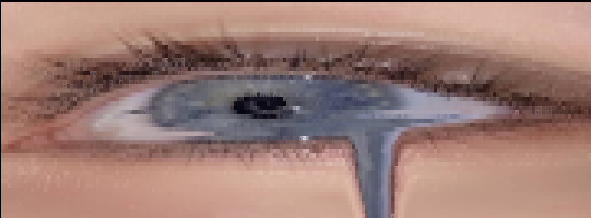
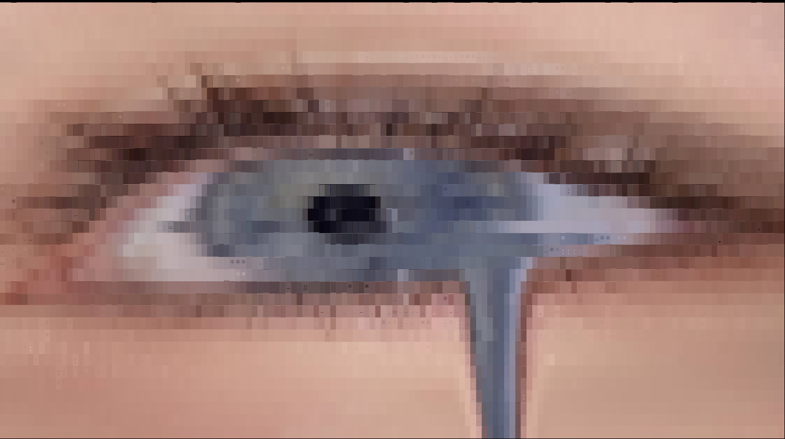

# glyphify

images to html




two modes:
- `braille`: 2x4 subpixel dots. fast, classic
- `glyph`: font-aware matching. Matches tone, edge magnitude, and edge direction

## usage

### braille
```bash
cargo run -- forSS.jpg -o out.html --mode braille --width 180 --zoom 1.5
```

### glyph
```bash
cargo run -- forSS.jpg -o glyph.html --mode glyph --width 140 --edge 0.55 --dir 0.35
```

## flags
- `--mode`: `braille` or `glyph`
- `--width`: output columns
- `--zoom`: html scale factor
- `--edge`: edge strength weight (glyph mode)
- `--dir`: edge direction weight (glyph mode)

MIT
